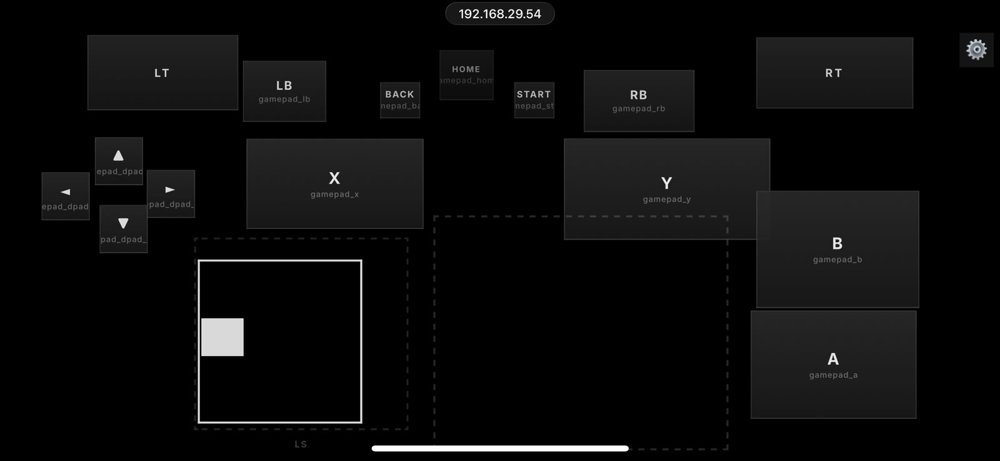
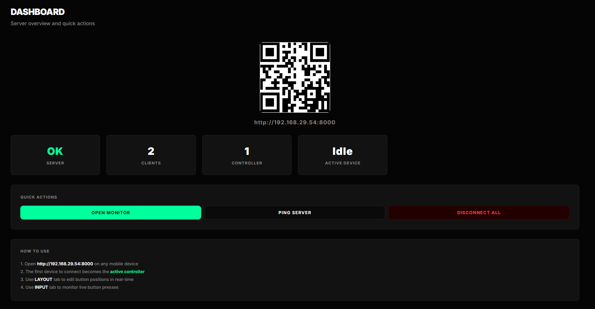
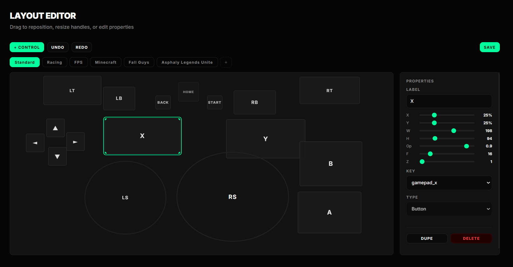
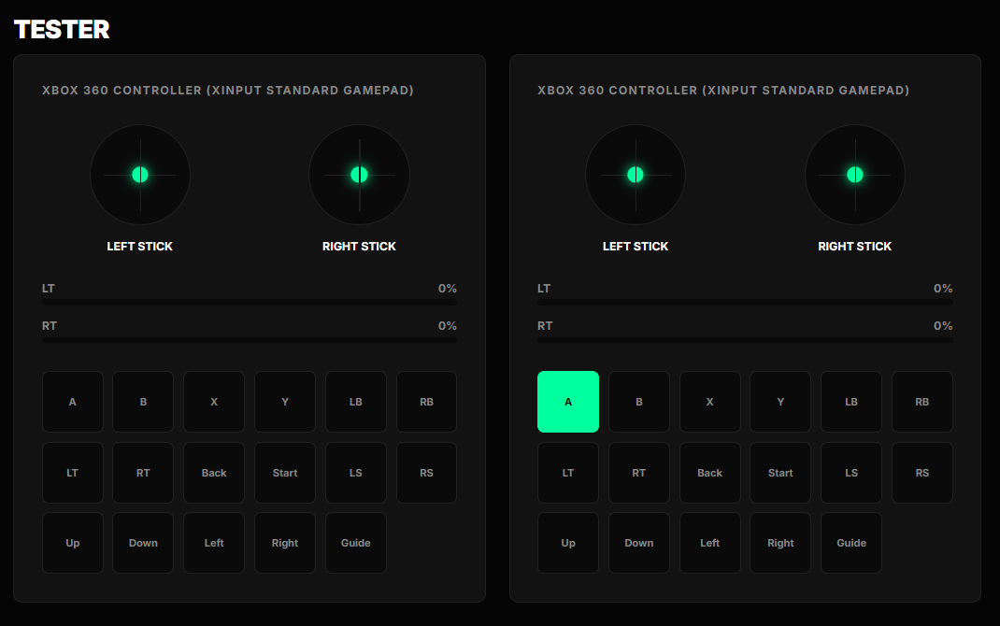

<div align="center">


# TouchKeys

### Turn a phone or tablet into a virtual Xbox 360 controller

Control PC games from a browser over your local network. TouchKeys has no mobile app, no app store account, and no client-side installation.

[](https://www.python.org/)
[](https://fastapi.tiangolo.com/)
[](https://www.microsoft.com/windows)
[](LICENSE)

</div>

## Overview

TouchKeys runs a small FastAPI server on your PC and sends touch input from a phone through WebSockets. On Windows, `vgamepad` exposes that input as an Xbox 360/XInput controller, so compatible games can use it like a physical gamepad.

- Browser-based mobile controller with buttons, D-pad, analog sticks, triggers, sliders, and touchpads
- Dynamic joysticks that center wherever your finger lands
- Custom layouts with multiple pages, live editing, undo/redo, and JSON import/export
- Desktop monitor with QR connection, client status, and controller testing
- Up to four connected phones, each assigned its own virtual controller slot
- Multi-touch input, haptic feedback where supported, auto-reconnect, and LAN-friendly latency

## Showcase

### Mobile controller

Open the server URL on any modern phone browser and use the customizable touch layout immediately.

<p align="center">
  
</p>

### Desktop dashboard

The dashboard displays the connection QR code, server health, connected clients, and quick actions.

<p align="center">
  
</p>

### Layout editor

Create game-specific pages and reposition or resize controls in real time.

<p align="center">
  
</p>

### Controller tester

Verify stick, trigger, and button input from the monitor before launching a game.

<p align="center">
  
</p>

# Games Tested
- Rocket League (Easy-Anticheat): Also opened in split screen. However, similar games with complex controls arent recommended.
- Fall Guys (Easy-Anticheat): Easy to play.
- Asphalt Legends Unite: Also tested in Splitscreen.
- Minecraft Bedrock Edition.
- Xbox App and Also Cloud Gaming.

Games with supported Xinput shall work perfect.

## Quick start

### Requirements

- Windows 10 or 11
- Python 3.9 or newer
- A phone and PC connected to the same Wi-Fi/LAN
- A modern mobile browser

`vgamepad` provides the virtual Xbox controller through ViGEmBus on Windows.

### Install and run

The easiest route is to right-click [`setup.ps1`](setup.ps1) and choose **Run with PowerShell**. The script:

- Finds Python 3.9 or newer, or installs Python 3.12 for the current user with `winget` if Python is not installed
- Creates the local `.venv` virtual environment
- Installs all packages from [`requirements.txt`](requirements.txt)
- Launches [`installers/ViGEmBus_1.22.0_x64_x86_arm64.exe`](installers/ViGEmBus_1.22.0_x64_x86_arm64.exe) once; approve the Windows administrator prompt and complete the installer

After setup, launch TouchKeys from PowerShell in the project folder:

```powershell
.venv\Scripts\python.exe gui.py
```

If PowerShell blocks scripts, run `Set-ExecutionPolicy -Scope Process Bypass` in that PowerShell window and start `setup.ps1` again. If `winget` is unavailable, install Python 3.9 or newer from [python.org](https://www.python.org/downloads/), then rerun the setup script.

For a manual setup:

```powershell
python -m venv .venv
.venv\Scripts\python.exe -m pip install -r requirements.txt
.venv\Scripts\python.exe gui.py
```

Manual setup still requires installing the ViGEmBus driver from [`installers/ViGEmBus_1.22.0_x64_x86_arm64.exe`](installers/ViGEmBus_1.22.0_x64_x86_arm64.exe). Then scan the QR code shown by the desktop monitor with your phone, or open the displayed URL in a phone browser.


## Configuration

Use the desktop monitor's **Layout** tab to customize controls. Layouts are stored in [`layout.json`](layout.json), while app preferences are stored in `settings.json`.

Supported control types include:

- `button` — momentary gamepad buttons and D-pad directions
- `analog_stick` — two-axis touch control with dead-zone filtering
- `trigger` — analog drag or digital tap mode
- `touchpad` — velocity-based input mapped to a stick
- `slider` — one-axis input mapped to a stick or trigger

For the full layout format, WebSocket protocol, and module responsibilities, see [`ARCHITECTURE.md`](ARCHITECTURE.md).

## Project structure

```text
TouchKeys/
├── server.py              # FastAPI and WebSocket entry point
├── gui.py                 # Desktop monitor launcher
├── controller/            # Gamepad, layout, storage, events, and networking
├── templates/             # Mobile app and desktop monitor shells
├── static/                # JavaScript, CSS, and favicon
├── images/                # README showcase images
├── layout.json            # Saved controller layout
├── requirements.txt       # Python dependencies
├── setup.ps1              # First-run setup
├── start.ps1              # Quick launch
└── ARCHITECTURE.md        # Detailed technical documentation
```

## Troubleshooting

- **Phone cannot connect:** make sure both devices are on the same network and that Windows Firewall allows Python on the private network.
- **Controller is not visible in games:** open `joy.cpl` and confirm the virtual Xbox 360 controller appears; restart after installing ViGEmBus if needed.
- **Input feels delayed:** use a stable 5 GHz connection and keep the phone near the router.
- **The server says the port is already in use:** close the existing TouchKeys process before starting another one.

## Known limitations

TouchKeys currently targets Windows because its virtual controller backend uses ViGEmBus. Gyroscope input is not included: mobile browsers restrict motion sensors on the local HTTP origin used for the zero-install LAN workflow.

## Roadmap

- [x] Xbox 360/XInput emulation
- [x] Multi-touch and analog controls
- [x] Custom layouts, pages, and undo/redo
- [x] Desktop monitor and controller tester
- [x] Up to four simultaneous virtual controllers
- [x] Keyboard and mouse input
- [ ] Live screen Streaming
- [ ] Standalone executable distribution

## Contributing

Bug reports, layout ideas, documentation improvements, and pull requests are welcome. Please test changes by connecting a phone and checking the result in `joy.cpl`.

## License

TouchKeys is released under the [MIT License](LICENSE).

<div align="center">

**TouchKeys — phone becomes gamepad.**

</div>
