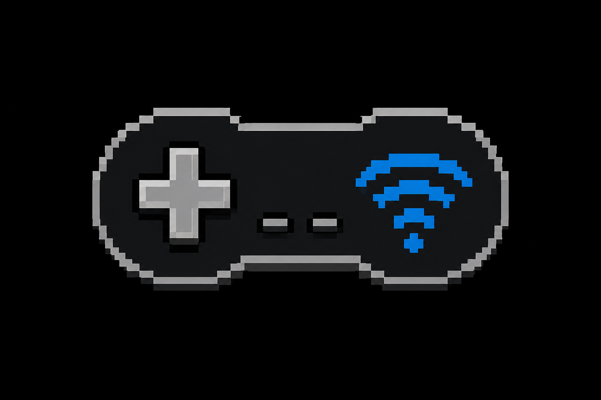

<div align="center">



# TouchKeys — Mobile Gamepad

### Turn any phone or tablet into a virtual Xbox 360 gamepad for your PC

[](https://www.python.org/)
[](https://fastapi.tiangolo.com/)
[](LICENSE)
[](https://github.com/)

**No installation on the phone. No app stores. No ads. Just a URL and a browser.**

</div>

---

## Table of Contents
- [Overview](#overview)
- [Important Disclaimers](#important-disclaimers)
  - [Anti-Cheat Warning](#anti-cheat-warning)
  - [Why Gyro Support Was Omitted](#why-gyro-support-was-omitted)
- [Quick Start](#quick-start)
  - [One-Click Setup](#one-click-setup)
  - [Manual Setup](#manual-setup)
  - [Connecting Your Phone](#connecting-your-phone)
- [Control Types](#control-types)
- [Layout Editor & Properties](#layout-editor--properties)
  - [Control Properties Reference](#control-properties-reference)
  - [JSON Layout Format](#json-layout-format)
- [Server & Multi-Controller Features](#server--multi-controller-features)
- [API Reference](#api-reference)
- [Project Architecture](#project-architecture)
- [Troubleshooting](#troubleshooting)
- [License](#license)

---

## Overview

Traditional phone-as-gamepad apps require downloading APKs/IPAs, installing mobile bloatware, or dealing with intrusive ads. **TouchKeys** takes a web-native approach:

- **Zero-Install Client**: Your mobile device only needs a modern browser. Open the local URL or scan a QR code to play.
- **Genuine Xbox 360 Emulation**: Uses the Windows ViGEmBus kernel driver via Python's `vgamepad` package. Games see a real XInput controller—no key-mapping hacks required.
- **Ultra-Low Latency**: High-frequency WebSocket communication (~60 updates/sec per touch) delivers smooth, responsive controls over local WiFi.
- **Full Customizability**: Drag, resize, and reconfigure every button, stick, trigger, touchpad, or slider in real-time from your PC desktop browser.
- **Multi-Controller Support**: Connect up to 4 phones simultaneously, each operating as an independent gamepad slot (P1–P4).

---

## Important Disclaimers

### Anti-Cheat Warning
Some strict kernel-level anti-cheat systems (e.g., Vanguard, Easy Anti-Cheat in specific competitive modes) may monitor or block virtual gamepad drivers like ViGEmBus. Use this software at your own discretion. 

*Note: In testing, games like Minecraft Bedrock, Fall Guys, Rocket League, and emulator titles executed without issues.*

### Why Gyro Support Was Omitted
Gyroscope and motion-sensor controls were evaluated during development, but intentionally omitted due to platform limitations:
1. **HTTP Sensor Restrictions**: Modern mobile browsers (iOS Safari, Android Chrome) block Motion and Orientation APIs on insecure HTTP origins.
2. **SSL/HTTPS Drawbacks**: Serving over local HTTPS via self-signed certificates causes aggressive browser security blocks.
3. **Cloud Latency**: Routing traffic through an external HTTPS relay adds massive input lag and introduces security concerns.
4. **App Store Overhead**: Building native `.apk`/`.ipa` wrappers would require app store developer fees and review pipelines, ruining the core zero-install, one-click philosophy.

---

## Quick Start

### One-Click Setup
1. Right-click `setup.ps1` → **Run with PowerShell**.
2. The script will automatically inspect your environment, set up Python dependencies in a local `.venv`, and prepare the runtime.
3. If PowerShell execution is disabled on your system, run this command once:
   ```powershell
   Set-ExecutionPolicy -Scope Process -ExecutionPolicy Bypass
   ```

### Manual Setup
Prerequisites: **Windows 10/11** and **Python 3.9+**.

```powershell
# Create environment and install dependencies
python -m venv .venv
.venv\Scripts\activate
pip install -r requirements.txt

# Start the server
python server.py
```

Or double-click `start.ps1` to launch the server and desktop monitor automatically.

### Connecting Your Phone
1. Ensure your PC and phone are connected to the same WiFi network.
2. Open the desktop control center in your PC browser at `http://localhost:8000/monitor`.
3. Scan the generated QR code on the dashboard using your phone's camera, or type the printed LAN URL (e.g. `http://192.168.1.100:8000`).

---

## Control Types

TouchKeys supports five distinct input element types:

| Type | CSS Class | Behavior |
|---|---|---|
| `button` | `.ctrl-btn` | Standard momentary push button (`A`, `B`, `X`, `Y`, D-pad, Shoulders, Start, Back). Flashes on tap. |
| `analog_stick` | `.ctrl-analog` | Dual-axis dynamic joystick. Centers wherever your finger first touches. Returns to `(0,0)` on release. |
| `trigger` | `.ctrl-trigger` | Single-axis pressure control (`LT`/`RT`). Supports smooth analog drag or digital instant-tap mode. |
| `slider` | `.ctrl-slider` | Linear 1-axis slider bar. Supports horizontal or vertical orientation. Can map to stick X/Y or triggers. |
| `touchpad` | `.ctrl-touchpad` | Velocity-based trackpad area with acceleration curve. Ideal for FPS camera look. |

---

## Layout Editor & Properties

Access the real-time editor by navigating to the **LAYOUT** tab in the desktop monitor (`/monitor`). All changes sync instantly to connected mobile devices.

### Control Properties Reference

When an element is selected in the editor, its properties can be adjusted in the sidebar panel:

| Property | Type | Options / Range | Description |
|---|---|---|---|
| `name` | string | Text input | Display label rendered on the control. |
| `keybind` | string | Dropdown | XInput target action (e.g. `gamepad_a`, `gamepad_ls`, `gamepad_lt`). |
| `type` | enum | `button`, `analog_stick`, `trigger`, `slider`, `touchpad` | Control behavior type. |
| `x`, `y` | float | `0.00` – `1.00` | Normalized position ratios relative to screen width/height. |
| `width`, `height` | int | `20` – `300` px | Dimensions of the control in CSS pixels. |
| `opacity` | float | `0.10` – `1.00` | Visual transparency level. |
| `fontSize` | int | `6` – `64` px | Label font size. |
| `layer` | int | `0` – `100` | Z-index stacking order for overlapping controls. |
| `deadzone` | float | `0.00` – `0.50` | *(Analog Stick only)* Inner dead zone threshold (default `0.15`). |
| `triggerMode` | enum | `analog`, `digital` | *(Trigger only)* `analog` for drag distance, `digital` for instant 1.0 tap. |
| `orientation` | enum | `horizontal`, `vertical` | *(Slider only)* Slider track layout direction. |
| `mappedAxis` | enum | `left_stick_x`, `left_stick_y`, `right_stick_x`, `right_stick_y`, `left_trigger`, `right_trigger` | *(Slider only)* Axis mapping option. |
| `sensitivity` | float | `0.25` – `3.00` | *(Touchpad only)* Drag velocity multiplier. |

### JSON Layout Format

Layouts are persisted in `layout.json` at the root directory:

```json
{
  "version": "2.0",
  "activePageIndex": 0,
  "pages": [
    {
      "id": "page-1",
      "name": "Standard",
      "buttons": [
        {
          "id": "btn-a",
          "name": "A",
          "keybind": "gamepad_a",
          "type": "button",
          "x": 0.85,
          "y": 0.62,
          "width": 54,
          "height": 54,
          "opacity": 1.0,
          "fontSize": 16,
          "layer": 1,
          "visible": true
        }
      ]
    }
  ]
}
```

---

## Server & Multi-Controller Features

- **Multi-Controller Slotting**: Supports up to 4 simultaneous gamepad slots (`P0` through `P3`).
- **Auto-Promotion**: The first connected phone becomes the active controller (`P0`). If `P0` disconnects, the next waiting device is automatically promoted.
- **Undo / Redo Stack**: Layout edits maintain an in-memory history stack on the server for effortless undoing/redoing.
- **Black & White Design Token System**: Clean, high-contrast monochrome design system focused on visibility and distraction-free gaming.

---

## API Reference

### HTTP Endpoints

| Method | Route | Description |
|---|---|---|
| `GET` | `/` | Serves the mobile client SPA. |
| `GET` | `/monitor` | Serves the desktop control panel dashboard. |
| `GET` | `/api/ip` | Returns server LAN IP address. |
| `GET` | `/api/keys` | Returns list of valid XInput keybind identifiers. |
| `GET` | `/api/clients` | Returns current active clients and slot assignments. |
| `GET` | `/api/debug` | Returns diagnostic server status and active key presses. |
| `DELETE` | `/api/clients/{id}` | Disconnects and kicks a connected client by ID. |

### WebSocket Gateway (`/ws`)
Transmits real-time input payloads (`keydown`, `keyup`, `analog`), heartbeat pings, and layout synchronization messages.

---

## Project Architecture

```
TouchKeys/
├── server.py             # FastAPI entry point & ASGI server setup
├── gui.py                # Optional launcher GUI & browser opener
├── setup.ps1             # Environment boostrap script
├── start.ps1             # Server execution script
├── layout.json           # Active layout configuration
├── settings.json         # Server settings
├── controller/           # Backend Python modules
│   ├── events.py         # WebSocket router & deduplication
│   ├── keyboard.py       # vgamepad XInput driver wrapper
│   ├── layout.py         # Layout CRUD & history manager
│   ├── network.py        # Connection tracking & slot promotion
│   ├── storage.py        # Safe atomic JSON I/O
│   └── config.py         # App configuration manager
├── templates/            # HTML templates
│   ├── index.html        # Mobile client SPA
│   └── monitor.html      # Desktop monitor & layout editor
└── static/               # Client static assets
    ├── css/main.css      # Design token stylesheet
    └── js/               # Client ES6 modules
        ├── app.js        # Main bootstrap & orchestration
        ├── controller.js # Touch event handlers & stick math
        ├── layout.js     # DOM element generator
        ├── websocket.js  # Reconnecting WebSocket client
        └── ui.js         # Status badges & notifications
```

---

## Troubleshooting

| Symptom | Probable Cause | Solution |
|---|---|---|
| **Phone shows "Disconnected"** | Network misconfiguration | Ensure PC and phone are on the same WiFi network and firewall permits port `8000`. |
| **Games fail to register input** | Missing driver or wrong slot | Verify `vgamepad` is installed and check Windows `joy.cpl` to confirm Xbox 360 pad presence. |
| **Stick movement feels jumpy** | Dead zone setting too small | Open element properties in `/monitor` and increase the `deadzone` value for the stick. |
| **Touch lag or delay** | WiFi congestion / Power saving | Connect PC via Ethernet or use 5 GHz WiFi band. Disable aggressive battery saver on phone browser. |

---

## License

This project is open-source under the **MIT License**. See the `LICENSE` file for full terms.
